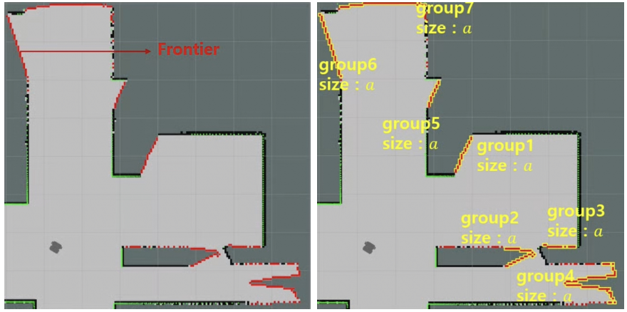
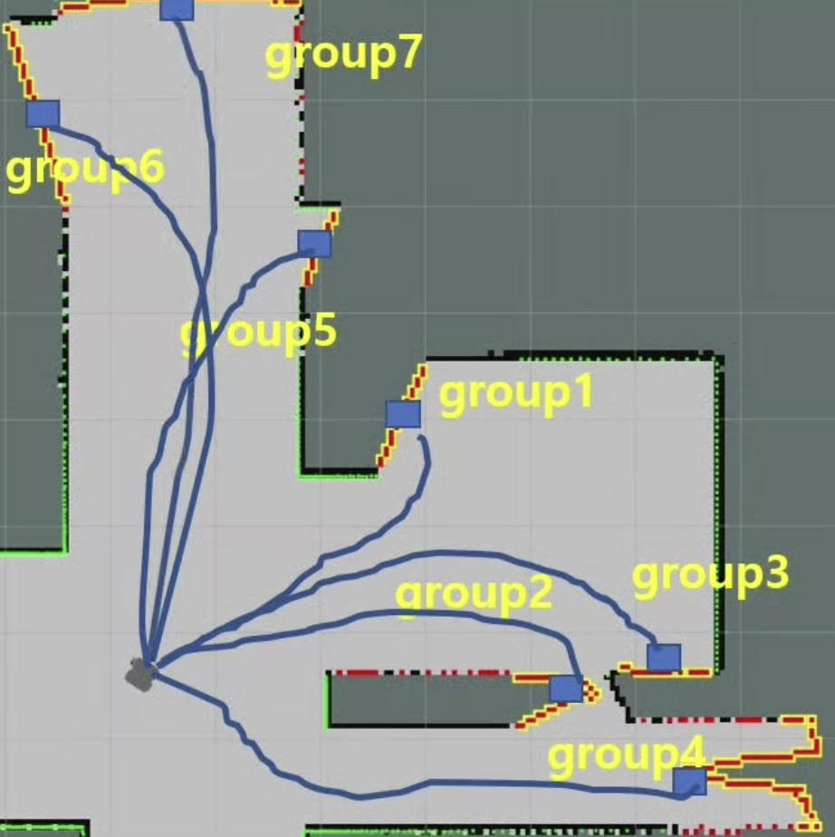
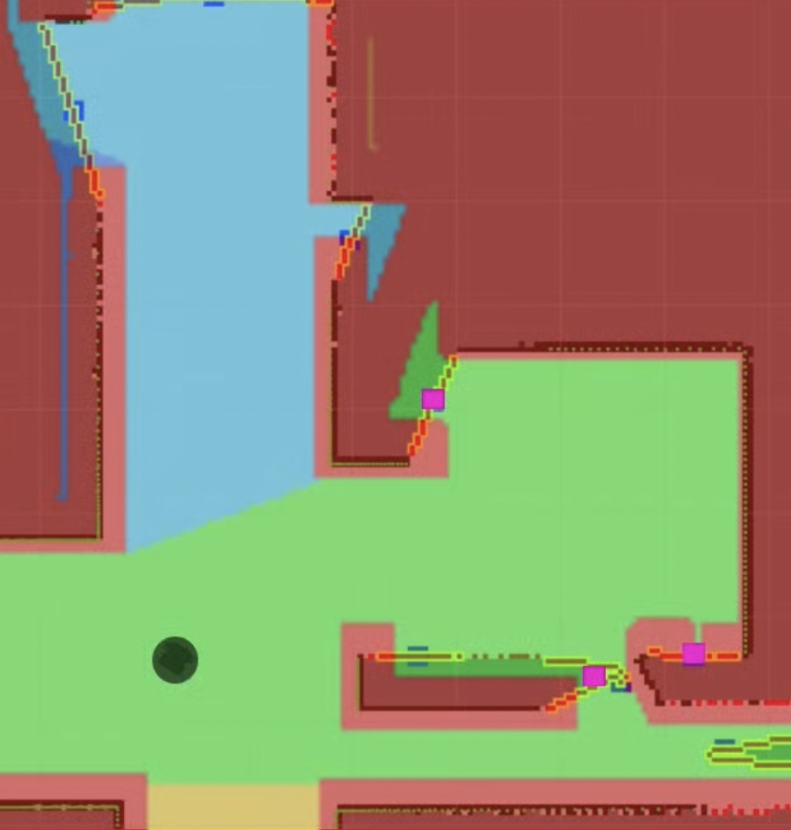
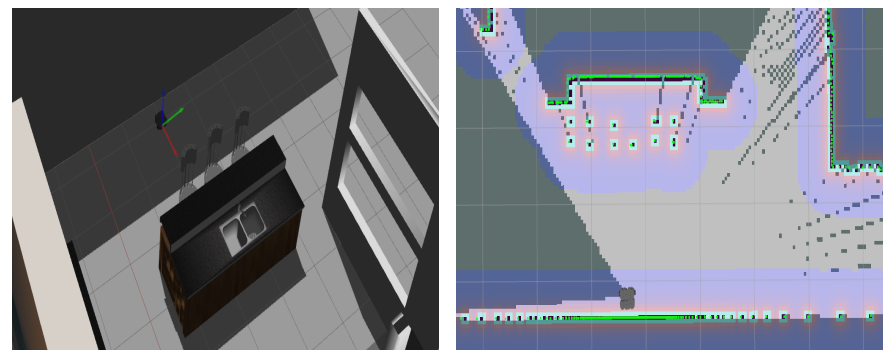
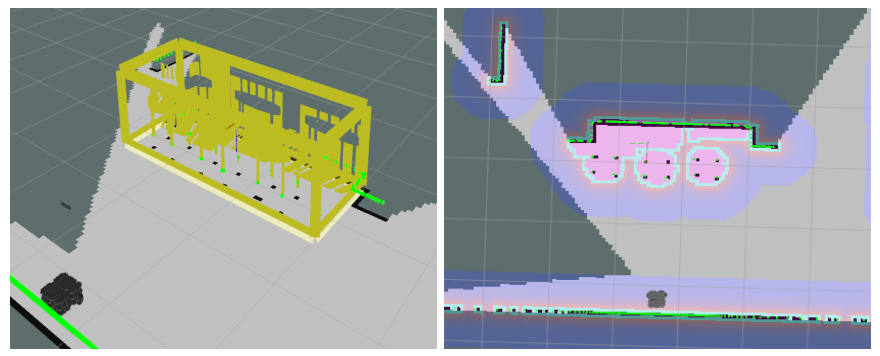
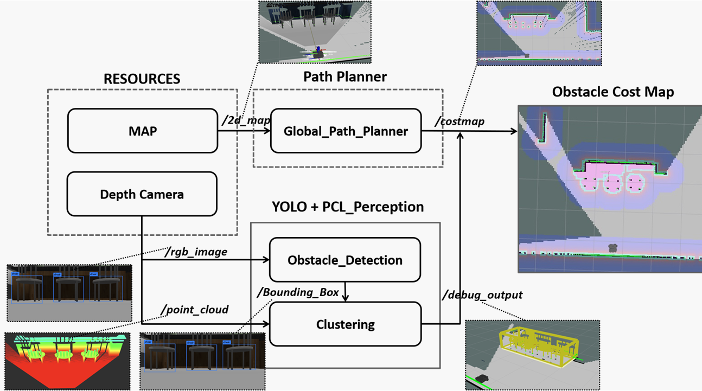

# Autonomous Exploration
---
Autonomous exploration package aims to explore unknown areas faster and more efficiently by selecting the most meaningful point as the next goal point.
To select the most meaningful point, we created a cost function based on 3 values: 2d map segmentation, the clustering size of the detected frontier, and the A* distance to the point.

---
##  Install
1. ROS-melodic
```	
    sudo apt update
    sudo apt upgrdae
    wget https://raw.githubusercontent.com/ROBOTIS-GIT/robotis_tools/master/install_ros_melodic.sh
    chmod +x ./install_ros_melodic.sh
    ./install_ros_melodic.sh
    sudo apt-get install ros-melodic-joy ros-melodic-teleop-twist-joy \
    ros-melodic-teleop-twist-keyboard ros-melodic-laser-proc \
    ros-melodic-rgbd-launch ros-melodic-depthimage-to-laserscan \
    ros-melodic-rosserial-arduino ros-melodic-rosserial-python \
    ros-melodic-rosserial-server ros-melodic-rosserial-client \
    ros-melodic-rosserial-msgs ros-melodic-amcl ros-melodic-map-server \
    ros-melodic-move-base ros-melodic-urdf ros-melodic-xacro \
    ros-melodic-compressed-image-transport ros-melodic-rqt* \
    ros-melodic-gmapping ros-melodic-navigation ros-melodic-interactive-markers
```
2. Tutrtlebot3 simulation pkg [Turtlbot3 E-Manual](https://emanual.robotis.com/docs/en/platform/turtlebot3/overview/#overview)
```	
    sudo apt-get install ros-melodic-dynamixel-sdk
    sudo apt-get install ros-melodic-turtlebot3-msgs
    sudo apt-get install ros-melodic-turtlebot3
    cd ~/catkin_ws/src/
    git clone -b melodic-devel https://github.com/ROBOTIS-GIT/turtlebot3_simulations.git
    cd ~/catkin_ws && catkin_make
```

3. 2d map segmentation pkg [incremental_DuDe_ROS](https://github.com/lfermin77/Incremental_DuDe_ROS)
```	
    sudo apt-get install libcgal-dev
    sudo apt-get install libmpfr-dev
    cd ~/catkin_ws/src/
    git clone https://github.com/lfermin77/Incremental_DuDe_ROS.git
    cd ~/catkin_ws && catkin_make
```

4. autonomous_exploration
```	
    cd ~/catkin_ws/src/
    git clone https://github.com/KimHyung/autonomous_exploration.git
    wstool update -t src
    rosdep install -y -r --from-paths ./turtlebot3_slam_3d/src --ignore-src
    cd ~/catkin_ws && catkin_make
```
---
## Launch
```	
    //1. Launch Gazebo Simulation
    roslaunch autonomous_exploration maze.launch
    //2. Launch SLAM & Rviz
    roslaunch autonomous_exploration gmapping.launch

    //3-1. Luanch autonomus exploration without yolo
    roslaunch autonomous_exploration autonomous_exploration.launch
    //3-2. Luanch autonomus exploration without yolo
    roslaunch autonomous_exploration yolo.launch
``````
---
## Description
To select the most meaningful point, we created a cost function based on 3 values: 2d map segmentation, the clustering size of the detected frontier, and the A* distance to the point.
### *size gain*
To detect and cluster frontiers, we used 8 direction search method.

In the 2D occupied grid map, the frontier is detected through an 8-direction search method based on the open space, and if there is a frontier in the grid in 8 directions near the detected frontier, clustering it as a group.

The size gain of each frontier group is the ***number of clustered frontiers*** / ***total number of frontiers***. That is, it is assumed that the larger the size gain value, the more information can be seen by going to the location of the corresponding group.



### *distance gain*
To calculate the actual distance to each frontier group, move_base package is used. Whenever a frontier group is newly created, the A* path length is calculated through a service call. To use the distance close to the robot as the next destination, the distance gain was calculated as e^(-distance).



### *region gain*
While the robot explores new areas (such as rooms and hallways), the robot often moves to other areas before exploring one area.

To solve this error, we used 2d map segmentation information to give the cost function an incept to search all the frontiers in the area if the area where the current robot is and the frontier group are in the same area.



---
## Result
X8


---
## Challenge (In progress)
In the cluttered environment, when autonomous driving using a 2d lidar sensor, the 3D size of various obstacles such as chairs and desks was not taken into account, so driving failed in many cases. To solve this error, simply create a 3D space using a visual slam or 3d lidar sensor and project it in 2d. (2) The 3d lidar sensor has a relatively high computational cost.


To solve this error, we would like to propose a method for recognizing an object and measuring the 3d size of the object.


